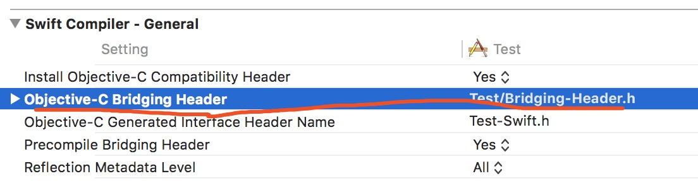

# GICXMLLayout

[](https://travis-ci.org/ghwghw4/GICXMLLayout)
[](https://cocoapods.org/pods/GICXMLLayout)
[](https://cocoapods.org/pods/GICXMLLayout)
[](https://cocoapods.org/pods/GICXMLLayout)

# 介绍

`GICXMLLayout`以下简称`gic`，是一个以XML来描述UI的一个库，同时兼有MVVM的功能。`gic`能够做什么？

1. 以XML来描述UI、动画等。
2. 纯粹的MVVM
3. 支持`数据绑定`,类似h5中`Vue`提供的数据绑定能力
4. 支持`模板功能`类似于h5中的模板功能。
5. 支持JS直接操作元素，支持使用JS来写业务逻辑(支持ES6规范)。
6. 强大的布局系统，甚至提供flex等复杂高效的布局
7. 强大的自定义能力，能够使得开发者按照自己的意愿扩展出能够直接使用XML来描述的任意功能。
8. 具有局部替换能力，可以对现有项目进行局部替换，使得局部功能具备MVVM+XML的能力。
9. 由于是直接采用XML来描述，因此天生具备实时更新的能力
10. `gic`的布局系统以及UI系统是基于`Texture`开发的，因此天生具有强大的性能优势

# 在线文档

[在线文档链接](http://gicxmllayout.gonghaiwei.cn/index.html)

## Installation

GICXMLLayout is available through [CocoaPods](https://cocoapods.org). To install
it, simply add the following line to your Podfile:

```ruby
pod 'GICXMLLayout', '~> 0.4.8'
```

## IDE & 脚手架支持

`GICXMLLayout`已经有了配套的IDE开发工具以及`脚手架`的支持，以便你更快的创建项目以及进行开发。

### IDE

目前`GICXMLLayout`在`VSCode`中开发了一款插件,名字叫`GICVSCodeExtension`，你可以直接在VSCode的插件市场中搜索安装，支持XML的智能提示、`JavaScript`编译、`HotReloading`、`HotUpdate测试`等功能。

### 脚手架

1. 执行如下命令安装脚手架。(请确保已经安装了nodejs和npm)

   ```bash
   sudo npm install gicxmllayout-cli -g
   ```

2. 执行如下命令，创建`GIC`工程。

   ```bash
   gic init YourProject
   ```

3. 根据提示进行模板选择以及安装。

安装完成后搭配`VSCode`进行开发将会极大的提升开发效率。

## Swift支持

从`0.2.1`版本开始，`GICXMLLayout`可以支持swift语言。但是由于`GICXMLLayout`本身是基于OC开发的，因此在Swift中使用的时候需要使用桥接。步骤如下：

1. 创建一个头文件。比如：`Bridging-Header.h`

2. 在头文件中添加如下头文件引用。

   ```objective-c
   #ifndef Bridging_Header_h
   #define Bridging_Header_h
   #import <GICXMLLayout/GICXMLLayout.h>
   #endif /* Bridging_Header_h */
   ```

3. 进入项目的`build settings`。然后找到`Objective-C Bridging Header`选项，将头文件的路劲添加上去。比如：

   

这样就可以在`Swift`中使用`GICXMLLayout`。

**另外一个需要注意点：**

1. 所有的ViewModel都必须继承自`NSObject`

2. 由于在Swfit4中， 继承自NSObject的Swift class 不再默认 BRIDGE 到 OC了，因此需要在class前面加上`@objcMembers` 这么一个关键字。比如

   ```swift
   @objcMembers class ViewModel: NSObject {
       ...
   }
   ```

3. 不支持对Int? Float?等值类型的可空解析。因此在定义swift class 的时候避免使用 值类型的可空类型。但是String、Array、Dictionary是可以定义成可空类型的。

   

> 事实上，不只是ViewModel需要遵循以上的规则，所有在ViewModel中使用到的class，都必须遵循上述规则。


## 更新日志

### 0.1.1

1. 新增样式(style)功能。[文档](http://gicxmllayout.gonghaiwei.cn/core/style.html)

   > 您现在可以为您的UI元素添加样式了，您也可以将样式定义在单独的XML文件中，这样您可以为你的APP添加类似主题(theme)的功能了

### 0.2.0

1. 增加`canvas`元素,当前处于`beta`阶段，但已经可以使用。[canvas文档](http://gicxmllayout.gonghaiwei.cn/ui/canvas.html)

   > 你现在可以直接使用`xml`来实现类似`Core Graphics`那样的功能了。你甚至可以直接使用`canvas`来实现一个报表，还支持动画哦。

2. 对`inpute`元素增加`keyboard-type `的支持。[文档](http://gicxmllayout.gonghaiwei.cn/ui/input.html)

3. 增加`control`元素。[文档](http://gicxmllayout.gonghaiwei.cn/ui/control.html)

   > `control`的功能类似`UIControl`，提供`enable`、`highlight`、`selected`等状态管理。

4. 增加`data-context`元素。[文档](http://gicxmllayout.gonghaiwei.cn/core/databingding.html)

   > 现在可以直接将一大段json 字符串作为数据源添加到`data-context`中了。

5. 增加`router`模块。[文档](http://gicxmllayout.gonghaiwei.cn/router.html)

### 0.2.1

增加对Swift的支持

### 0.2.2

1. `lable`元素增加对`font`属性的支持，现在可以为`lable`指定字体了。[文档](http://gicxmllayout.gonghaiwei.cn/ui/lable.html)

2. `canvas`元素中的`path`新增`dash`属性，现在可以为线条添加虚线的设置了。[文档](http://gicxmllayout.gonghaiwei.cn/ui/canvas.html)

3. 调整事件分发机制。增加`double-tap`、`touch-begin`、`touch-move`、`touch-end`事件。[文档](http://gicxmllayout.gonghaiwei.cn/attribute.html)

   > 目前已经将touch事件优化成直接使用系统本身提供的的事件分发机制。

### 0.3.0

这个版本因为涉及到对js的支持，在所有的版本中开发时间是最长的也是最艰难的一个版本。

1. list添加对header和footer的支持。[文档](http://gicxmllayout.gonghaiwei.cn/ui/list.html)

2. list添加对section的支持。[文档](http://gicxmllayout.gonghaiwei.cn/ui/list.html)

   > 支持多个section。当然也支持数据绑定。现在的list的功能已经很接近`UITableView`提供的功能了。
   >
   > 注意：在使用方式上跟原来大体上无差别，但是需要把原来的`list-item`放入某个`section`元素中。不再支持裸的`list-item`。

3. 新增`collection-view`。[文档](http://gicxmllayout.gonghaiwei.cn/ui/collection-view.html)

   > 功能上类似`UICollectionView`，list支持的功能`collection-view `同样支持。

4. 新增`script `元素，提供对js的支持。[文档](http://gicxmllayout.gonghaiwei.cn/script.html)

   > 现在您可以直接使用js来操作UI元素的属性，甚至使用JS来实现业务逻辑。

### 0.3.1

1. 新增`grid-panel`布局。[文档](http://gicxmllayout.gonghaiwei.cn/layout/grid-panel.html)

   > 布局效果类似collecttion-view，只是`grid-panel`没有滚动条，适合在list、collection-view等列表的list-item中使用。会自动计算内容高度。

2. Script新增对setInterval 、clearInterval 的支持。

### 0.3.2

1. 为`Script`增加JSAPI注册器。以便扩展JSAPI[文档](http://gicxmllayout.gonghaiwei.cn/js-extension.html)

   > 现在你可以通过`GICJSAPIManager `来为动态添加JSAPI，以便形成你自己的一套独有的JSAPI集合。

2. `list`、`collection-view`所有的section都支持添加header、footer。[文档](http://gicxmllayout.gonghaiwei.cn/ui/list.html)

3. 动画触发条件支持任意事件。[文档](http://gicxmllayout.gonghaiwei.cn/core/animation.html)

### 0.4.0

1. 增加JSRouter相关API，专门用来支持JS 导航相关。[文档](http://gicxmllayout.gonghaiwei.cn/script.html)

2. Router模块中的`nav-bar`元素增加`title`子元素

   > 现在你可以通过`nav-bar`的`title`节点自定义page 的 title-view

3. `image`元素新增`path`属性。[文档](http://gicxmllayout.gonghaiwei.cn/ui/image.html)

   > 现在可以直接加载根目录下的图片

4. JS API修改.[文档](http://gicxmllayout.gonghaiwei.cn/script.html)

   > 1. 获取事件参数。可以通过$eventInfo 获取事件参数
   > 2. 增加`require`函数。现在可以在任意JS 脚本的任意位置动态加载js 文件

5. list 元素增加显示索引功能。并且进一步的优化了显示性能。[文档](http://gicxmllayout.gonghaiwei.cn/ui/list.html)

### 0.4.2

1. for指令增加对数组的insert 支持。

   > 1. NSMutableArray 增加对方法`insertObjects:atIndexes:`的支持。
   > 2. JS数组目前对splice 方法的已经得到完整支持。

2. bug 修复。

### 0.4.3

1. 新增JS 调用Toast 提示的API
2. 增加了对Spring动画的支持。


### 0.4.4

1. 新增`transforms`形变元素。[文档](http://gicxmllayout.gonghaiwei.cn/ui/transforms.html)

### 0.4.5

1. `JSRouter`增加返回层级的参数。[文档](http://gicxmllayout.gonghaiwei.cn/script.html)

   > 你现在可以选择返回的页面层级了。

### 0.4.6

1. 将`Router`中的`页面返回按钮`隐藏文字。

2. `scroll-view`元素增加水平滚动功能。[文档](http://gicxmllayout.gonghaiwei.cn/ui/scroll-view.html)

3. `lable`元素增加如下功能。[文档](http://gicxmllayout.gonghaiwei.cn/ui/lable.html)

   > 1. 提供对`link`的支持。
   > 2. 提供下划线、删除线的支持。

### 0.4.8

1. for指令支持遍历JS对象。

2. 完善`require`函数。用法相当于node.js中的用法

3. 内置`Promise`API

4. 支持`yield`以及`generator`。

   > 现在GIC已经可以支持ES8中的`async`、`await`了。

### 0.5.0 

1. 新增附加属性系统。


## Author

海伟, 693963124@qq.com

## License

GICXMLLayout is available under the MIT license. See the LICENSE file for more info.
