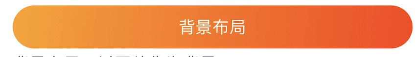

# background-panel

`background-panel`是一种背景布局。也就是可以将子元素覆盖在背景之上。比如：有背景图片的布局，或者使用渐变色作为背景的布局，而作为`背景`的的元素也可以是任何`panel`或者其他的UI元素。`background-panel`在没有显示width、height的情况下，以子元素的width、height为准。作为背景的元素不会影响整个`background-panel`的尺寸。


作为`背景`的元素必须处于`background-panel`的`background`的节点之下。非`background`的节点，将会被解析成子元素，但是`background-panel`只支持一个非背景的子元素。


## 例子1

下面以渐变色作为背景为例

```xml
<background-panel height="42" space-before="20">
    <background>
        <gradient-view colors="FFA218 0 FF3F0A 1" corner-radius="21">
        </gradient-view>
    </background>
    <dock-panel>
        <lable text="背景布局" font-size="16" font-color="white" />
    </dock-panel>
</background-panel>
```




## 例子2

以图片作为背景布局。

```xml
<background-panel space-before="20">
    <background>
        <image url="http://img5.duitang.com/uploads/item/201204/01/20120401222440_eEjyC.thumb.700_0.jpeg"/>
    </background>
    <dock-panel  height="100">
        <lable text="背景布局2 - 前景1" font-size="16" font-color="white" />
    </dock-panel>
</background-panel>
```

