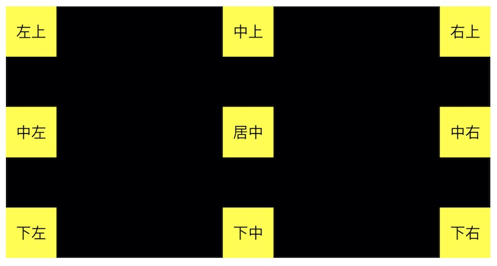

# dock-panel

`dock-panel`是一种停靠布局，通过设置子元素的`dock-horizal`和`dock-vertical`两个属性可以将子元素停靠在panel的9个位置，如果不设置这两个属性，那么默认居中显示。如果子元素没有显示设置width 和 height，那么默认该子元素撑满整个`dock-panel`。


## 例子

```xml
<dock-panel background-color="black" height="200" space-before="20">
    <template-ref t-name="p-child" data-context="左上" dock-horizal="0" dock-vertical="0"/>
    <template-ref t-name="p-child" data-context="中上" dock-horizal="1" dock-vertical="0"/>
    <template-ref t-name="p-child" data-context="右上" dock-horizal="2" dock-vertical="0"/>
    <template-ref t-name="p-child" data-context="中左" dock-horizal="0" dock-vertical="1"/>
    <template-ref t-name="p-child" data-context="居中"/>
    <template-ref t-name="p-child" data-context="中右" dock-horizal="2" dock-vertical="1"/>
    <template-ref t-name="p-child" data-context="下左" dock-horizal="0" dock-vertical="2"/>
    <template-ref t-name="p-child" data-context="下中" dock-horizal="1" dock-vertical="2"/>
    <template-ref t-name="p-child" data-context="下右" dock-horizal="2" dock-vertical="2"/>
</dock-panel>
```


