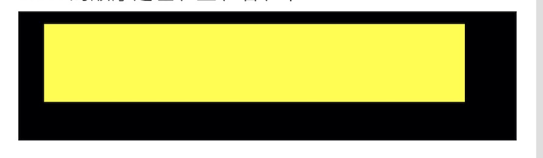

# inset-panel

`inset-panel`在h5中算是一个padding布局。也就是给子元素一个内边距。`inset-panel`只支持单个的UI元素，因此你可以在`inset-panel`中插入一个其他的种类的布局面板。


## 属性

| 名称    | 数据类型         | 介绍                    | 是否支持绑定 | 是否支持动画 |
| ----- | ------------ | --------------------- | ------ | ------ |
| inset | UIEdgeInsets | 内边距。按照 `上 左 下 右`的顺序设置 | 是      | 是      |

## 示例

1. 左上右下 都为10的内边距

```Xml
<inset-panel inset="10" background-color="black" height="100">
    <panel background-color="yellow"/>
</inset-panel>
```

2. 上下:10，左右:20

```xml
<inset-panel inset="10 20" background-color="black" height="100">
    <panel background-color="yellow"/>
</inset-panel>
```

3. 上:20 左:20 下:30 右:40

```xml
<inset-panel inset="10 20 30 40" background-color="black" height="100">
    <panel background-color="yellow"/>
</inset-panel>
```


