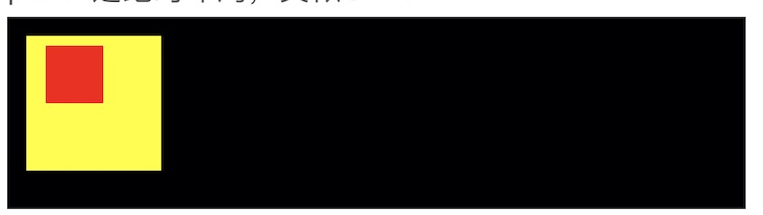

# panel

`gic`中的布局系统是基于`Texture`开发的，提供了多种布局panel，最基本的是`panel`，提供绝对布局功能，类似于直接采用frame布局。

通过设置子元素的`position`属性来达到类似frame中origin的功能。

例子1：

```Xml
<panel background-color="black" height="100">
    <!--子元素相对于左上角偏移x:10 y:10-->
    <panel size="70" position="10" background-color="yellow">
        <!--子元素相对于左上角偏移x:10 y:5-->
        <panel size="30" position="10 5" background-color="red"/>
    </panel>
</panel>
```




如果没有设置子元素的size、position，那么默认撑满父元素。(**除lable**)

```Xml
<panel background-color="black" height="100">
    <panel background-color="red"/>
</panel>
```

