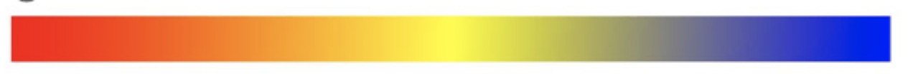
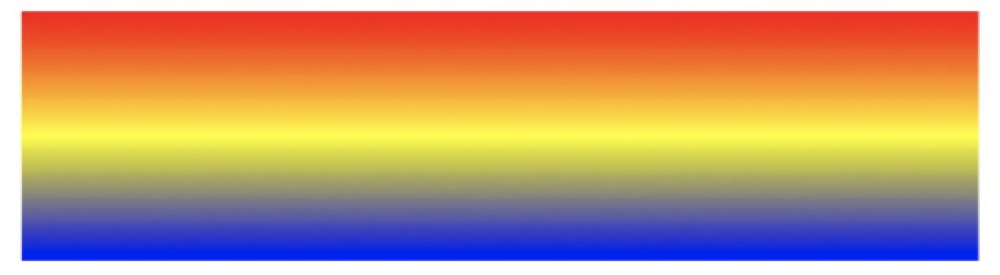

# gradient-view

`gradient-view`是一个支持渐变色的UI元素，当然也就是只支持渐变色。

## 属性

| 名称   | 数据类型       | 介绍                                 | 是否支持绑定 | 是否支持动画 |
| ------ | -------------- | ------------------------------------ | ------------ | ------------ |
| colors | GradientColors | 颜色和位置成对的一个组合，以空格分隔 | 是           | 否           |
| start  | CGPoint        | 渐变色起始点                         | 是           | 否           |
| end    | CGPoint        | 渐变色结束点                         | 是           | 否           |


## 例子

1. 水平渐变

```xml
<gradient-view height="20" colors="red 0 yellow 0.5 blue 1" />
```



2. 垂直渐变

```xml
<gradient-view height="100" space-before="10" colors="red 0 yellow 0.5 blue 1" start="0.5 0" end="0.5 1"/>
```

